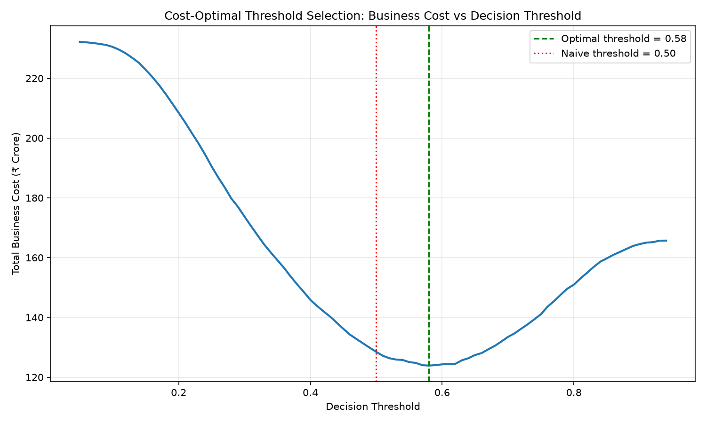

# Behavioral Credit Risk & Lifestyle Default Assessor

**A real-data ML risk engine with cost-optimal decisioning, SHAP explainability, fairness auditing, and a live economic stress-test simulator.**

🔗 **Live Dashboard:** [behavorial-credit-risk.streamlit.app](https://behavorial-credit-risk.streamlit.app/)
🔗 **Live API Docs:** [credit-risk-api-ifvr.onrender.com/docs](https://credit-risk-api-ifvr.onrender.com/docs)
📂 **Source:** this repo

> Note: the API is hosted on Render's free tier, which spins down after periods of inactivity. The first request after idle time may take 30–60 seconds to respond while the server wakes up.

---

## The 30-Second Pitch

Most credit models tell you *whether* to reject someone. This one tells you *why*, *what it costs the business*, and *what happens if the economy turns*.

I trained an XGBoost default classifier on 307,511 real loan applications, made every prediction individually explainable with SHAP, translated the model's decision threshold into a rupee cost curve anchored to real loan economics, audited it for gender bias, and wrapped it in a live dashboard where a loan officer can simulate a salary cut or inflation shock and watch the risk score respond in real time — backed by the actual trained model, not a canned animation.

---

## Why This Project Exists

Traditional student ML projects train on synthetic, self-generated data — which proves nothing, since the model just learns the rules the author already wrote into the data generator. This project deliberately avoids that trap: it trains on the **Home Credit Default Risk** dataset (Kaggle), 307,511 real loan applicants with real repayment outcomes. The "behavioral" angle — how lifestyle and EMI burden relate to default — is tested as a *hypothesis against real data*, not assumed.

---

## Architecture

```
Raw Data (Home Credit, 307k applicants)
        │
        ▼
Feature Engineering (src/features.py)
  → shared by training AND the live API, eliminating train/serve skew
        │
        ▼
XGBoost Classifier (class-weighted for 11:1 imbalance)
        │
        ▼
Cost-Curve Threshold Optimization  →  SHAP Explainability
        │                                    │
        ▼                                    ▼
FastAPI (deployed on Render)  ←───────────────┘
        │
        ▼
Streamlit Dashboard (deployed on Streamlit Cloud)
  → Applicant form + Economic Downturn Simulator
```

**Stack:** Python, Pandas, NumPy, scikit-learn, XGBoost, SHAP, FastAPI, Pydantic, Streamlit, Render, Streamlit Cloud.

---

## Key Findings

### 1. The accuracy trap, proven on real numbers

Only 8.07% of applicants in the dataset defaulted. A naive Logistic Regression baseline achieved **92% accuracy** — while catching just **1% of actual defaulters** (recall = 0.01). It had simply learned to predict "repaid" for almost everyone. This is the single most common pitfall in imbalanced classification, and this project demonstrates it directly rather than just citing it.

| Model | ROC-AUC | Defaulted Recall | Accuracy |
|---|---|---|---|
| Logistic Regression (baseline) | 0.7235 | 0.01 | 0.92 |
| **XGBoost (class-weighted, 11.4:1)** | **0.7372** | **0.67** | 0.68 |

Class-weighting (`scale_pos_weight`) forced the model to actually try on the rare class — recall jumped from 1% to 67%, at the cost of overall accuracy dropping to 68%. That tradeoff is expected and correct: accuracy is the wrong metric for an imbalanced problem like this one.

### 2. Cost-optimal decisioning beats the default 0.5 threshold

Rather than accepting scikit-learn's arbitrary 50% cutoff, I anchored real business costs to the dataset's median loan size (₹5,13,531):
- **False Negative** (approved a defaulter): 65% Loss-Given-Default → ₹3,33,795
- **False Positive** (rejected a good customer): 8% lost margin → ₹41,082

Sweeping every threshold from 0.05 to 0.94 against these costs on the held-out test set found a true minimum at **threshold = 0.58**, saving **₹4.57 crore** compared to the naive 0.50 default across 61,503 test applicants.



Notably, the optimal threshold (0.58) sits *above* the naive default, not below — because while missing a defaulter is individually 8x more expensive, the sheer volume of good-customers (11x more common than defaulters) means flooding rejections to catch a few more bad actors isn't worth it. This tension between cost-asymmetry and class-imbalance was a real, non-obvious finding from the analysis, not an assumption going in.

### 3. The model explains every decision (SHAP)

Every prediction returns the top 3 features driving that specific applicant's score, not just a number:

```json
{
  "default_probability": 0.8358,
  "decision": "REJECT",
  "top_risk_factors": [
    {"feature": "EXT_SOURCE_2", "impact": 1.1603},
    {"feature": "EXT_SOURCE_3", "impact": 1.0609},
    {"feature": "credit_to_income", "impact": -0.4234}
  ]
}
```

### 4. A real, honestly-reported fairness gap

Auditing false-positive rates (good customers wrongly rejected) across gender — despite gender never being used as a model feature — found:

| Gender | False Positive Rate | n |
|---|---|---|
| Female | 0.290 | 40,561 |
| Male | 0.374 | 20,940 |

This gap likely arises because the model's strongest predictors (`EXT_SOURCE_1/2/3`, external bureau scores) act as proxies correlated with gender — a known limitation called **"fairness through unawareness."** Hiding a sensitive attribute from a model doesn't guarantee fair outcomes if other features encode it indirectly. Mitigating this (reweighting, post-hoc threshold adjustment per group) is flagged as future work rather than silently ignored.

### 5. The Economic Downturn Simulator reveals what actually drives risk

The dashboard lets a user stress-test any applicant against simulated salary cuts and essential-expense inflation, re-scoring them live through the real deployed model. Testing this systematically produced a genuinely counter-intuitive finding: **even a severe compound shock — 70% income reduction combined with 70% essential-cost inflation, pushing the EMI-to-income ratio to 71% — moved a mid-range applicant's risk by only ~3 percentage points** (43.6% → 46.9%).

This confirms what the Phase 1 correlation analysis already hinted at: `emi_to_income` is a comparatively weak standalone predictor in this dataset, while bureau credit scores (`EXT_SOURCE_1/2/3`) dominate the model's risk assessment. The simulator independently re-confirmed a static finding through a completely different method — live perturbation instead of correlation — which is a good signal the pipeline is internally consistent.

---

## Project Structure

```
├── notebooks/          # EDA, feature engineering, modeling, cost curve, fairness audit
├── src/
│   └── features.py     # Single source of truth for feature engineering — used in training AND the API
├── api/
│   ├── main.py          # FastAPI service: validation, inference, SHAP explanation
│   └── features.py       # Mirrors src/features.py for deployment
├── app/
│   └── dashboard.py     # Streamlit UI + Economic Downturn Simulator
├── models/
│   ├── xgb_model.pkl
│   ├── imputer.pkl
│   └── cost_curve.png
└── requirements.txt
```

---

## Running Locally

```bash
git clone https://github.com/Sayan7anDa5/Behavorial-Credit-Risk.git
cd Behavorial-Credit-Risk
python3 -m venv .venv
source .venv/bin/activate
pip install -r requirements.txt

# Terminal 1 — start the API
uvicorn api.main:app --reload

# Terminal 2 — start the dashboard
streamlit run app/dashboard.py
```

(You'll need `application_train.csv` from [Home Credit Default Risk](https://www.kaggle.com/datasets/megancrenshaw/home-credit-default-risk) in a `data/` folder to re-run the notebooks — pretrained model artifacts are already included in `models/`.)

---

## What I'd Build Next

- Address the fairness gap with per-group threshold calibration
- Bring in the bureau/previous-application tables for richer features
- Add a Dockerfile for fully reproducible deployment
- Replace the free-tier cold-start delay with a paid always-on instance

---

## Data Source

[Home Credit Default Risk](https://www.kaggle.com/datasets/megancrenshaw/home-credit-default-risk) — 307,511 real loan applications with repayment outcomes.
